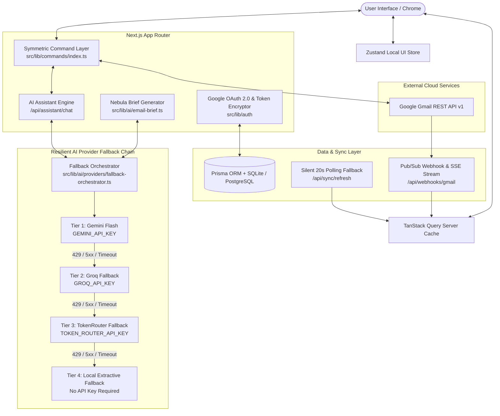

# 🌌 Nebula Mail — Production-Grade AI-Native Email Client

Nebula Mail is a state-of-the-art, production-ready, AI-native web email client built on top of **Next.js 16 (App Router + Turbopack)**, **TailwindCSS**, **TanStack Query v5**, **Zustand**, **Prisma ORM**, and the **Google Gmail REST API**. 

It features a symmetric command architecture where every user interaction and AI assistant tool call route through the exact same execution pipeline, guarded by a **Human-in-the-Loop Authorization System**, a **3-Tier Multi-Provider AI Fallback Chain (Gemini → Groq → TokenRouter → Local Extractive Engine)**, and real-time **Nebula Brief** AI email summarization.

---

## 🏗️ Architectural Overview & System Design

Nebula Mail bridges modern frontend state management with Google Cloud infrastructure, live Gmail REST APIs, and a resilient multi-provider AI engine.



---

## 🔑 Order of AI API Keys & Resilient Fallback Engine

When Nebula Mail processes an AI request (such as an AI Assistant natural language query or generating a Nebula Brief), it evaluates providers in the following strict priority order:

1. **First Priority — `GEMINI_API_KEY` (Google Gemini)**
   - Fast, high-capacity primary model (`gemini-1.5-flash` / `gemini-2.5-flash`).
   - If configured and operational, requests complete instantly via Tier 1.
2. **Second Priority — `GROQ_API_KEY` (Groq Llama 3)**
   - Engaged automatically if Gemini is unconfigured, rate-limited (HTTP 429), timing out (>12s), or experiencing server errors (5xx).
   - High-speed open-weights inference engine.
3. **Third Priority — `TOKEN_ROUTER_API_KEY` (TokenRouter AI)**
   - Engaged automatically if both Gemini and Groq fail or run out of quota.
   - Provides seamless continuity via GPT-4o-mini compatible routing.
4. **Fourth Priority — Local Extractive NLP Engine (Fail-Safe)**
   - Zero external API key requirement.
   - Automatically engages if all external cloud providers fail or key quotas are exhausted.
   - Ensures the application **NEVER crashes** or returns a blank error to the user!

---

## 🌟 Comprehensive Feature List & Step-by-Step Testing Guide

### 1. Resizable 3-Column Layout
- **How it works**: Managed by `react-resizable-panels` across three panes: Navigation Rail (Left), Email List & Smart Filters (Center), and Email Detail / AI Brief Pane (Right).
- **How to test**: Drag the vertical border lines between columns to resize.
- **Expected reaction**: Layout resizes smoothly without breaking text overflow or creating horizontal scrollbars. Panel width preferences persist across refreshes.

### 2. Live Gmail Sync & Offline Demo Seed
- **How to test**: Click the static circular refresh icon next to the Inbox header, or connect your Google Account via OAuth.
- **Expected reaction**: The refresh icon spins smoothly while fetching from `/api/sync/refresh`. The list updates immediately with live Gmail messages or pre-seeded demo emails.

### 3. Read Status Auto-Sync
- **How to test**: Click on any unread email (marked with a green dot indicator).
- **Expected reaction**: The unread green dot instantly clears client-side AND dispatches a background request to remove the `UNREAD` label from Gmail API.

### 4. Smart Search & Filter Chips
- **How to test**: Type keywords in the top search bar (e.g. `google`, `invoice`, `unread`), or click quick filter chips like "Unread", "Has Attachment", or date filters.
- **Expected reaction**: Active filter chips display below the search bar. The email list filters instantly in real time. Clicking the "X" on a chip clears that filter cleanly.

### 5. Nebula Brief (AI Email Summarizer)
- **How to test**: Select an email in the list and click the **`✨ Generate Brief`** button in the reading pane.
- **Expected reaction**: An animated skeleton shimmer appears while analyzing. Once ready, it displays a structured summary, explicit action items, deadlines, key points, and a suggested reply draft with a **`Draft Reply`** button.
- **Draft Reply interaction**: Clicking "Draft Reply" opens the Compose modal pre-filled with recipient details and suggested text.

### 6. AI Assistant Panel & Natural Language Control
- **How to test**: Click preset suggestion chips in the right-side Assistant Panel (e.g., *"Search emails from last 10 days"*, *"Show me unread emails"*, or *"Draft an email to john@example.com"*), or type custom natural language commands.
- **Expected reaction**: The AI Assistant analyzes the request, triggers real-time tool calls, updates the Action Timeline (`running` -> `completed`), and performs the corresponding UI action automatically.

### 7. Human-in-the-Loop Authorization Card
- **How to test**: Ask the AI Assistant to send an email (e.g., *"Send email to alice@example.com with subject Project Update"*).
- **Expected reaction**: Instead of silently sending external communications, an **Authorization Required** card appears in the Assistant drawer. You can inspect recipients, subject, body, add local file attachments via paperclip, and click **Approve & Send** or **Cancel**.

### 8. Compose Form & Multi-File Attachments
- **How to test**: Click the **New Message** button or paperclip icon. Select local files (PDFs, images, documents).
- **Expected reaction**: Attachment chips appear with formatted file sizes (e.g., `2.4 MB`). Sending dispatches an RFC 2822 multipart MIME email, clears filters, switches to Sent view, and updates the thread.

### 9. Recoverable Trash & Permanent Delete
- **How to test**: Click **Trash** on an email to move it to Trash view. Navigate to Trash, and click **Restore** or **Delete Permanently**.
- **Expected reaction**: Moving to trash syncs with `/api/mail/[id]/trash`. Restoring returns the email to the inbox. Permanent delete displays a confirmation card and removes the row cleanly.

---

## 🛠️ Setup & Running Instructions

### 1. Prerequisites
- **Node.js**: v18.0.0 or higher
- **npm**: v9.0.0 or higher

### 2. Environment Configuration (`.env`)

Create a `.env` file in the root directory based on `.env.example`:

```env
DATABASE_URL="file:./dev.db"
NEXT_PUBLIC_APP_URL="http://localhost:3001"

# Google OAuth 2.0 Credentials (Gmail API)
GOOGLE_CLIENT_ID="your-google-client-id.apps.googleusercontent.com"
GOOGLE_CLIENT_SECRET="your-google-client-secret"
GOOGLE_REDIRECT_URI="http://localhost:3001/api/auth/callback/google"

# Multi-Provider AI Keys
GEMINI_API_KEY="your-gemini-api-key"
GROQ_API_KEY="your-groq-api-key"
TOKEN_ROUTER_API_KEY="your-token-router-api-key"

# Auth Secrets
AUTH_SECRET="super-secret-jwt-cookie-key-min-32-chars"
ENCRYPTION_SECRET="0123456789abcdef0123456789abcdef"
```

### 3. Execution Commands

```bash
# Install dependencies
npm install

# Push database schema to local SQLite
npx prisma db push

# Run development server
npm run dev
```

Open **[http://localhost:3001](http://localhost:3001)** in your browser.

---

## 🧪 Verification & Automated Test Suite

```bash
# 1. Static Typecheck (0 Errors)
npx tsc --noEmit

# 2. Vitest Unit Test Suite (24/24 Passed)
npm test

# 3. Next.js Production Build Verification
npm run build
```

---

## 📄 License & Attributions

Built with ❤️ for modern AI-native productivity. Powered by Next.js, TailwindCSS, TanStack Query, Zustand, Prisma, Google Gmail API, and Google Gemini AI.
