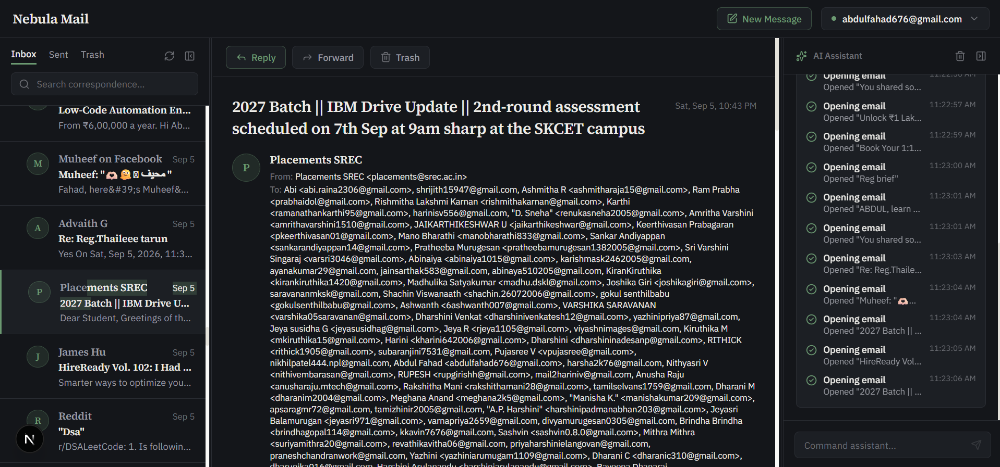
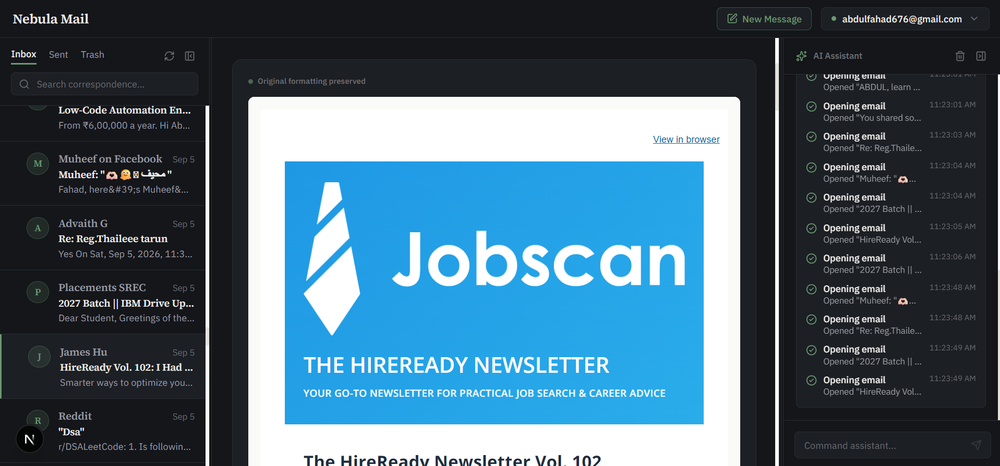
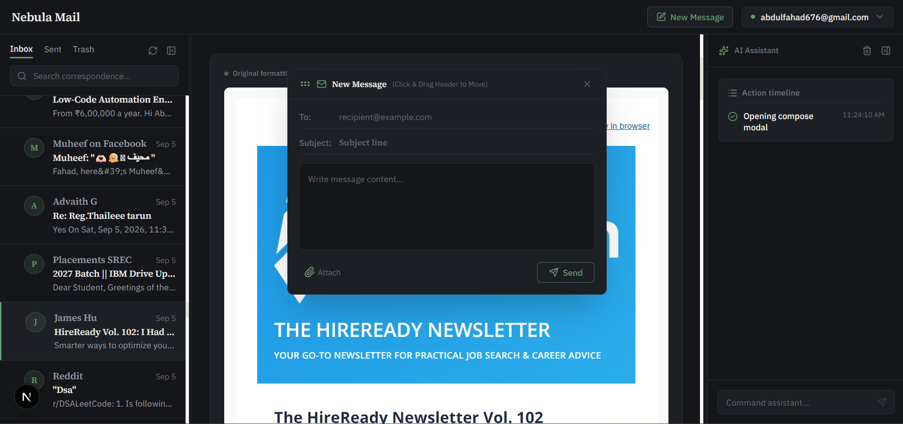
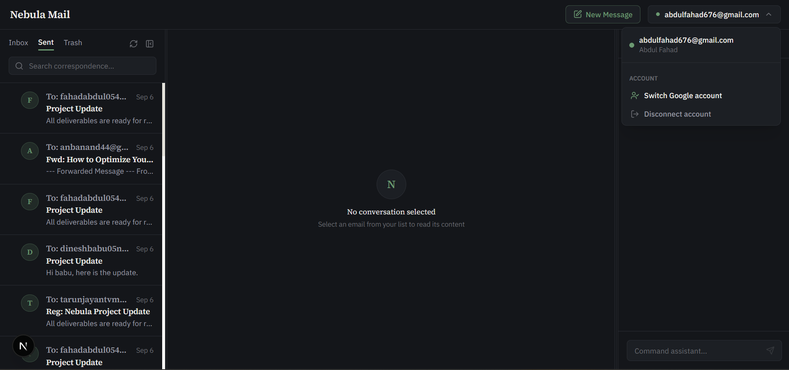

# Nebula Mail

Nebula Mail is a Gmail-connected email client where an AI assistant operates the application directly. Telling it to search, filter, compose, or reply doesn't produce a description of what it would do — it calls the same functions a manual click would, and the inbox, filter chips, and compose form update on screen because of it.

Built for the Nebula KnowLab AI-Powered Mail Web App hiring assignment: *"Build a mail app where the AI assistant controls the UI."*

## Screenshots

**Real Gmail data, including edge cases.** This message has over 60 recipients, parsed and rendered correctly rather than truncated or broken. The right panel is the assistant's action timeline, logging each step as it works.



**Third-party HTML, isolated.** Newsletters and marketing emails bring their own CSS, fonts, and layout assumptions. This one renders inside its own sandboxed container, sized to its actual content — no bleed into the app's own interface, no dead space below it, nothing clipped.



**Compose, with attachments.** Beyond To/Subject/body, the compose window supports attaching real files from the device, encoded and sent as a proper multipart MIME message.



**Account switching and a correctly-labeled Sent view.** Sent rows are labeled by recipient, not by the signed-in account's own address — a distinction that sounds trivial and isn't; get it wrong and every sent email in the list looks identical.



## The five required scenarios

The brief specifies five natural-language behaviors the assistant has to demonstrate. All five route through the same command layer described below, not special-cased logic:

1. *"Send an email to john@example.com with subject Meeting Tomorrow and body Let's meet at 3pm"* — opens compose, fills every field visibly, holds the message behind a confirmation card, sends only on approval.
2. *"Show me emails from the last 10 days"* — a real date-range filter applied to the actual inbox, not a text description of results.
3. *"Find the email from Sarah about the project update"* — resolves a search to a specific message and opens it in the reading pane.
4. *"Reply that I'll handle it tomorrow"* (while an email is open) — reads which email is currently open, drafts a contextual reply, confirms before sending.
5. *"Show only unread emails from this week"* — a compound filter, both conditions applied together, shown as separate removable chips.

## Architecture

Every interaction — a UI click or an instruction to the assistant — goes through one command layer before it ever touches Gmail:

```
UI click  ──┐
             ├──▶  src/lib/commands  ──▶  Gmail service  ──▶  Gmail REST API
AI request ──┘             │
                            ▼
                     Application state ──▶ UI updates
```

The assistant never calls the Gmail API directly. It calls a fixed set of Zod-validated commands — `search_emails`, `open_email`, `apply_email_filter`, `open_compose`, `populate_compose`, `send_email`, `reply_to_email`, `forward_email` — and those are the exact same functions the manual UI controls call. A filter dropdown and a typed instruction that both mean "unread emails from this week" produce identical results because they're the same code path, not two implementations that happen to agree.

Server state (emails, threads, search results) lives in TanStack Query. UI-only state (selected email, open panels, active filters-as-UI-state, compose drawer) is kept separately in Zustand, so the two are never tangled together.

## AI provider chain

Assistant requests and Nebula Brief generation go through a fallback chain rather than depending on one provider:

1. **Gemini** (`gemini-2.5-flash`) — primary
2. **Groq** (`openai/gpt-oss-120b`) — engaged on a retryable failure from Gemini (rate limit, server error, timeout)
3. **TokenRouter** — engaged if Groq also fails retryably
4. **A local, non-API extractive fallback** — so the app degrades gracefully instead of failing outright if every external provider is unavailable

All three external providers implement the same interface and return a normalized `{ text, toolCalls, provider }` shape, so neither the command layer nor Nebula Brief needs to know which one actually answered. Only genuinely retryable failures advance down the chain — a bad API key surfaces immediately as a configuration error rather than silently falling back and masking the real problem.

## Real-time sync

New mail sent to the account from outside the app arrives through Gmail's push mechanism: a registered mailbox watch notifies a Cloud Pub/Sub topic, which pushes to this app's webhook, which fetches only what changed since the last sync (via `historyId`, not a full refetch) and streams the update to the browser over Server-Sent Events. The watch is renewed automatically before it expires.

Pub/Sub push requires a public HTTPS endpoint, which a plain `localhost` dev server doesn't have. Locally, the app also polls for changes every 20 seconds as a fallback so new mail still shows up without a manual refresh — this fallback becomes unnecessary once the app is deployed somewhere with a real public URL.

## Visual design

The interface deliberately avoids the generic dark-theme-plus-neon-accent look most AI-assistant UIs default to. The system is built on exactly two typefaces and a three-color palette:

- **Source Serif 4** for the wordmark, email subject lines, and sender names
- **IBM Plex Sans** for everything else — UI chrome, buttons, timestamps, body text
- A paper background, near-black ink text, and a single restrained bottle-green accent (`#24463A`) reserved for unread indicators, active states, and the primary action button — never used as a background fill or spread across multiple UI elements

A secondary dark theme exists as a toggle, following the same two-color-plus-accent logic inverted rather than introducing new hues.

## Tech stack

Next.js (App Router) · React · TypeScript · Tailwind CSS · Zustand · TanStack Query · Prisma · Gmail REST API · Google OAuth 2.0 · Google Cloud Pub/Sub · Server-Sent Events · Zod · Vitest · Playwright

## Setup

### Prerequisites

- Node.js 18 or later
- npm

### 1. Install and configure

```bash
npm install
cp .env.example .env
```

Fill in `.env`:

```env
DATABASE_URL="file:./dev.db"
NEXT_PUBLIC_APP_URL="http://localhost:3001"

GOOGLE_CLIENT_ID="your-google-client-id.apps.googleusercontent.com"
GOOGLE_CLIENT_SECRET="your-google-client-secret"
GOOGLE_REDIRECT_URI="http://localhost:3001/api/auth/callback/google"

GEMINI_API_KEY="your-gemini-api-key"
GROQ_API_KEY="your-groq-api-key"
TOKEN_ROUTER_API_KEY="your-token-router-api-key"

AUTH_SECRET="a-random-32-character-or-longer-string"
ENCRYPTION_SECRET="a-32-byte-hex-string-for-aes-256-gcm"
```

### 2. Google OAuth (Gmail access)

1. In the [Google Cloud Console](https://console.cloud.google.com), create or select a project and enable the **Gmail API**.
2. Configure the OAuth consent screen with the Gmail scopes the app needs: read, send, and modify.
3. Under **Credentials**, create an **OAuth 2.0 Client ID** for a web application, and add `http://localhost:3001/api/auth/callback/google` as an authorized redirect URI (add the deployed URL too, later, if hosted elsewhere).
4. Copy the client ID and secret into `.env`.

### 3. Google Cloud Pub/Sub (real-time push)

1. Enable the **Cloud Pub/Sub API** in the same project.
2. Create a topic, e.g. `gmail-notifications`.
3. Grant `gmail-api-push@system.gserviceaccount.com` the **Pub/Sub Publisher** role on that topic.
4. Create a push subscription on the topic with the endpoint set to `https://<your-domain>/api/webhooks/gmail`.
5. Locally, expose `localhost:3001` with a tunnel (`ngrok http 3001`) and point the subscription at the tunnel's HTTPS URL — Pub/Sub can't reach `localhost` directly. Without this, the app still works via its polling fallback.

### 4. Database and run

```bash
npx prisma db push
npm run dev
```

Open `http://localhost:3001`.

## Testing

```bash
npx tsc --noEmit      # type check
npm test               # unit tests (Vitest)
npx playwright test    # end-to-end tests covering the 5 required scenarios
npm run build           # production build check
```

## Design decisions and trade-offs

**SQLite instead of PostgreSQL.** The brief specified Postgres; this project uses SQLite through Prisma for local development, since it needs no separate database service. The schema is Prisma-managed, so pointing it at Postgres for a real deployment is a datasource change, not a rewrite — connection pooling and concurrent-write handling would need attention at that point, which SQLite sidesteps locally.

**One command layer instead of separate UI and AI code paths.** This costs some upfront abstraction, but it's the reason the assistant can never drift out of sync with what the UI itself can do — there's no second implementation of "apply a filter" to fall out of date.

**Trash instead of permanent delete by default.** Deleting a message moves it to Gmail's actual Trash rather than removing it outright, matching real Gmail behavior and leaving a recovery path before anything is irreversible. Permanent delete exists, but only from within the Trash view, gated behind its own confirmation.

**A 4-tier AI fallback instead of a single provider.** Three external providers plus a local extractive fallback means an evaluator testing the AI assistant isn't at the mercy of any one API's rate limit during a live demo.

## Known limitations

- Real-time push (Gmail Watch → Pub/Sub → webhook) requires a public HTTPS endpoint; on a plain local dev server this falls back to 20-second polling instead.
- Forward is available as a manual UI action but not yet as an assistant-invokable command.
- Large mailboxes haven't been tuned for pagination performance beyond what TanStack Query's default caching provides.

## Future improvements

- Thread/conversation view grouping related messages
- Reply and forward available directly through the assistant's natural-language flow
- A deployed instance with a stable public URL, removing the local polling fallback entirely
