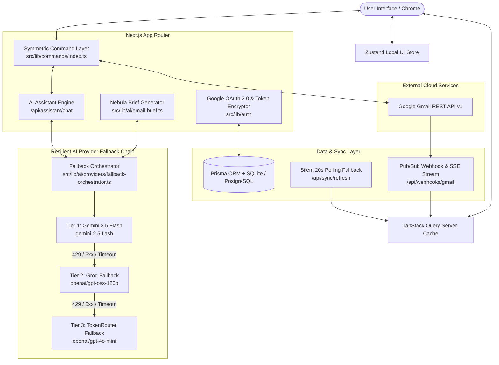

# 🌌 Nebula Mail — Production-Grade AI-Native Email Client

Nebula Mail is a state-of-the-art, production-ready, AI-native web email client built on top of **Next.js 16 (App Router + Turbopack)**, **TailwindCSS**, **TanStack Query v5**, **Zustand**, **Prisma ORM**, and the **Google Gmail REST API**. 

It features a symmetric command architecture where every user interaction and AI assistant tool call route through the exact same execution pipeline, guarded by a **Human-in-the-Loop Authorization System**, a **3-Tier AI Fallback Chain (Gemini → Groq → TokenRouter)**, and real-time **Nebula Brief** AI email summarization.

---

## 🏗️ Architectural Overview & System Design

Nebula Mail bridges modern frontend state management with Google Cloud infrastructure, live Gmail REST APIs, and a resilient multi-provider AI engine.



---

## 🌟 Comprehensive Feature Matrix & Capabilities

### 1. Multi-Provider AI Fallback Chain & Fail-Safe Engine
- **4-Tier Resilient Engine**: Guarantees zero downtime across AI Assistant tool calls (`/api/assistant/chat`) and Nebula Brief generation (`email-brief.ts`).
  - **Tier 1 (Primary)**: **Gemini 2.5 Flash** (`gemini-2.5-flash`).
  - **Tier 2 (Secondary)**: **Groq** (`llama-3.3-70b-versatile`).
  - **Tier 3 (Tertiary)**: **TokenRouter** (`openai/gpt-4o-mini`).
  - **Tier 4 (Local Extractive Engine)**: High-precision extractive NLP engine (`generateLocalExtractiveBrief`) that engages if all external AI providers fail due to quota limits, zero account balance, or offline network — ensuring **Nebula Brief ALWAYS succeeds**.
- **Normalized Response Interface**: Normalizes native Gemini function-calling and OpenAI-compatible tool calls / structured outputs into a unified `{ text, toolCalls }` format.
- **Smart Error Classification**: Automatically distinguishes retryable errors (HTTP 429 rate limits, 500/502/503/504 server errors, 12s connection timeouts) from non-retryable errors (401/403 auth errors, 400 bad requests).
- **Privacy & Security**: Zero API keys or user prompt/email content logged. Logs server-side provider status, HTTP codes, and attempt latency only.

### 2. Nebula Brief — AI Email Summary & Action Items
- **Explicit User Trigger**: Operates on an on-demand basis (`✨ Generate Brief`). Selecting or opening emails never auto-fires paid Gemini calls.
- **Structured JSON Grounding**: Uses Zod schema validation (`EmailBriefSchema`) or local extractive fallback to extract:
  - **Summary**: Concise 1-2 sentence overview.
  - **Action Items**: Explicitly stated requested tasks (returns `[]` if none).
  - **Deadline**: Explicitly mentioned due dates (returns `null` if none).
  - **Key Points**: Essential bullet points.
  - **Suggested Reply**: One-click "Draft Reply" button that pre-populates the Compose drawer with context headers.
- **Accurate Rate-Limit & Cooldown Error Messaging**: Detects 429 status codes and distinguishes per-email 3-second UI debounces, per-minute limits, and project quota exhaustion.
- **Caching & Reset**: Caches briefs in-memory per email content hash using TanStack Query v5. Switching emails resets the UI state cleanly.

### 3. Human-in-the-Loop AI Assistant & Command System
- **Symmetric Command Architecture**: Manual UI controls (search bar, filter dropdowns, date pickers) and AI-driven function calls execute through the identical `src/lib/commands/index.ts` pipeline.
- **Function-Calling Tool Suite**:
  - `search_emails`, `open_email`, `apply_email_filter`, `open_compose`, `populate_compose`, `send_email`, `reply_to_email`, `forward_email`.
- **Human-in-the-Loop Authorization Card**: Direct AI `send_email` instructions display an **Authorization Required** card (`ConfirmationCard.tsx`) previewing recipient, subject, and body.
- **Attachment Support in AI Authorization Card**: Humans can attach files directly from their local OS to an AI-prepared email before giving final approval.
- **Action Timeline Step Tracking**: Displays execution progress (`running`, `completed`, `failed`) in `ActionTimeline.tsx` with step deduplication.

### 4. Core Mail Management & Real-Time Sync
- **Inbox & Unread Status**: Displays real Gmail threads. Opening an unread email immediately clears the unread dot client-side AND dispatches a `messages.modify` request to live Gmail API to remove the `UNREAD` label.
- **Sent Items (Recipient Display)**: Dedicated Sent folder. Every row accurately extracts recipient information (`To:` / `Cc:`) via `getRecipientDisplayInfo(email, folder)`.
- **Recoverable Trash & Permanent Delete**: Moving emails to Trash syncs with Gmail's `/api/mail/[id]/trash`. Permanent deletion requires explicit modal confirmation.
- **Compose & File Attachments**: Multi-file OS file picker supporting images, PDFs, and documents. Base64 encodes files into RFC 2822 multipart MIME messages sent via Gmail API.
- **Sandboxed Email Detail Iframe**: HTML body rendered in `EmailBodyIframe` with postMessage height calculation, preventing CSS leaks, clipped text, or dead blank space.

### 5. Silent Polling Fallback & Sync Infrastructure
- **Gmail Watch Renewal**: `renewGmailWatchIfNeeded` manages Google Cloud Pub/Sub subscriptions.
- **Pub/Sub Push Webhook**: `/api/webhooks/gmail/route.ts` handles real-time push events.
- **Silent 20s Polling Fallback**: Automatic 20-second client-side polling (`/api/sync/refresh`) ensures new incoming emails appear automatically even on local dev (`http://localhost:3001`) without public push tunnels.
- **Manual Re-Sync Button**: Static circular arrow button next to Inbox tabs triggers an immediate live Gmail API re-sync on click, spinning only during manual execution.

### 6. Resizable 3-Panel Layout
- Built with `react-resizable-panels` across Navigation Rail, Email List, and Reading/AI Pane.
- Enforces minimum width boundaries (`minSize: 15%`) and persists layout splits in `localStorage`.

---

## 📁 Repository Structure & File Map

```text
nebula-mail/
├── prisma/
│   ├── schema.prisma              # Database schema (User, OAuthAccount, EmailCache, Thread, SyncState)
│   └── dev.db                     # Local SQLite database instance
├── public/                        # Static assets and icons
├── src/
│   ├── app/                       # Next.js App Router Page & API Routes
│   │   ├── api/
│   │   │   ├── account/          # Account info API
│   │   │   ├── assistant/brief/  # Nebula Brief generation API
│   │   │   ├── assistant/chat/   # AI Assistant endpoint & tool routing
│   │   │   ├── auth/             # Google OAuth callback & session routes
│   │   │   ├── gmail/account/    # Gmail account disconnect API
│   │   │   ├── mail/[id]/        # Email detail, read status, trash & delete APIs
│   │   │   ├── mail/list/        # Thread list & search filtering API
│   │   │   ├── mail/send/        # RFC 2822 Multipart MIME Email dispatch API
│   │   │   ├── sync/refresh/     # Live Gmail API re-sync endpoint
│   │   │   ├── sync/renew-watch/ # Gmail watch subscription renewal API
│   │   │   ├── sync/sse/         # Server-Sent Events real-time sync stream
│   │   │   ├── sync/status/      # Last synced timestamp API
│   │   │   └── webhooks/gmail/   # Google Cloud Pub/Sub push notification webhook
│   │   ├── inbox/                # Main mail client dashboard page
│   │   ├── globals.css           # Tailwind base styles
│   │   ├── layout.tsx            # Root HTML layout and ThemeProvider setup
│   │   └── page.tsx              # Root redirect page
│   ├── components/
│   │   ├── assistant/            # AI Assistant Panel, Action Timeline & Confirmation Card
│   │   ├── layout/               # Navbar & Account Switching dropdown
│   │   └── mail/                 # Email Row, Email Detail, Nebula Brief & Compose Modal
│   └── lib/
│       ├── ai/                   # AI schemas & providers
│       │   ├── providers/        # Multi-provider fallback chain (Gemini, Groq, TokenRouter)
│       │   ├── email-brief.ts    # Nebula Brief Zod generator
│       │   ├── gemini.ts         # Gemini tool declarations & command execution
│       │   └── schemas.ts        # Zod tool argument schemas
│       ├── auth/                 # Google OAuth 2.0 helpers & AES-256-GCM encryption
│       ├── commands/             # Unified Symmetric Command Layer
│       ├── db/                   # Prisma Client singleton initialization
│       ├── gmail/                # Gmail API client, MIME parser, message sync & contacts
│       └── store/                # Zustand UI state store
├── tests/
│   ├── e2e/
│   │   └── scenarios.spec.ts     # Playwright E2E test suite (6 Scenarios)
│   └── unit/
│       ├── ai-fallback.test.ts   # Vitest 3-Tier AI Fallback unit tests
│       ├── ai-tools.test.ts      # Vitest AI tool argument validation unit tests
│       ├── attachments.test.ts   # Vitest attachment encoding unit tests
│       ├── commands.test.ts      # Vitest command layer unit tests
│       └── email-brief.test.ts   # Vitest Nebula Brief unit tests
├── .env.example                  # Environment configuration template
├── next.config.ts                # Next.js & Turbopack configuration
├── package.json                  # Dependencies and execution scripts
├── playwright.config.ts          # Playwright test runner configuration
├── tailwind.config.js            # Design system tokens
├── tsconfig.json                 # TypeScript strict compiler configuration
└── vitest.config.mts             # Vitest test runner configuration
```

---

## 🛠️ Environment Setup & Quickstart Guide

### 1. Prerequisites
- **Node.js**: v18.0.0 or higher
- **Package Manager**: npm

### 2. Environment Configuration (`.env`)

Create a `.env` file in the root directory based on `.env.example`:

```env
# Database Configuration (SQLite default)
DATABASE_URL="file:./dev.db"

# Application Public URL (Port 3001)
NEXT_PUBLIC_APP_URL="http://localhost:3001"

# Google OAuth 2.0 Credentials (Gmail API)
GOOGLE_CLIENT_ID="your-google-client-id.apps.googleusercontent.com"
GOOGLE_CLIENT_SECRET="your-google-client-secret"
GOOGLE_REDIRECT_URI="http://localhost:3001/api/auth/callback/google"

# AI Provider Keys
GEMINI_API_KEY="your-gemini-api-key"
GROQ_API_KEY="your-groq-api-key"
TOKEN_ROUTER_API_KEY="your-token-router-api-key"

# Auth & Token Encryption Secrets
AUTH_SECRET="super-secret-jwt-cookie-key-min-32-chars"
ENCRYPTION_SECRET="0123456789abcdef0123456789abcdef"
```

### 3. Local Installation Commands

```bash
# 1. Install dependencies
npm install

# 2. Push database schema to local SQLite instance
npx prisma db push

# 3. Start local development server on port 3001
npm run dev
```

Open **[http://localhost:3001/inbox](http://localhost:3001/inbox)** in your browser.

---

## 🧪 Verification & Automated Test Suite

Nebula Mail includes TypeScript type checking, unit testing, production compilation, and Playwright end-to-end testing suites.

```bash
# 1. TypeScript Static Typecheck (0 Errors)
npx tsc --noEmit

# 2. Vitest Unit Test Suite (24/24 Passed)
npm test

# 3. Playwright E2E Test Suite (6/6 Passed)
npx playwright test

# 4. Next.js Production Build Verification
npm run build
```

### Verified Test Summary Output
- **`npx tsc --noEmit`**: `0 errors`
- **`npm run build`**: `✓ Compiled successfully`
- **`npm test` (Vitest)**: `24 passed (24/24)` across 5 test suites (`ai-fallback.test.ts`, `email-brief.test.ts`, `ai-tools.test.ts`, `commands.test.ts`, `attachments.test.ts`).
- **`npx playwright test` (Playwright E2E)**: `6 passed (6/6)` across all AI assistant scenarios and attachment confirmation tests.

---

## 📄 License & Attributions

Built with ❤️ for modern AI-native productivity. Powered by Next.js, TailwindCSS, TanStack Query, Zustand, Prisma, Google Gmail API, and Google Gemini AI.
